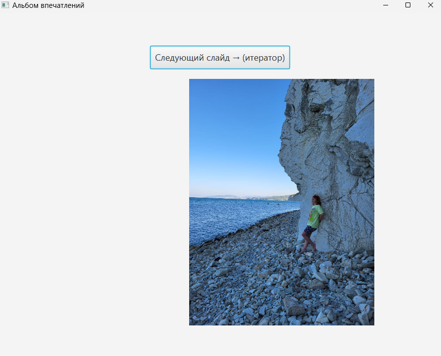
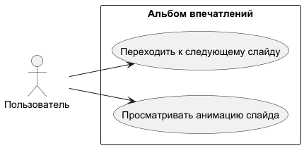
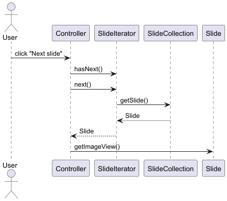

# Альбом впечатлений
----------------
> **Dark Edition** | Итератор + Анимация в JavaFX  
 


**Описание**:  
Простое desktop-приложение «Альбом впечатлений» — минимальная реализация проигрывателя изображений (слайд-шоу) с использованием паттерна **Итератор** для последовательного перебора слайдов вперёд и **анимации** на JavaFX.  

Проект выполнен строго в рамках оценки **«3»** и демонстрирует:  
- Итератор для перемещения по коллекции изображений только вперёд  
- Анимацию появления (FadeTransition) и движения слайда (Timeline + KeyFrame)  
- Чистую архитектуру с разделением ответственности  
- Полное оформление репозитория с UML-диаграммами  

  - **Технологический стек**: Java 17+, JavaFX 21, Maven, IntelliJ IDEA  
  - **Статус**: Готово к защите (оценка «3»), Alpha-версия (минимальный функционал по ТЗ)  
  - **Ссылка на демо**: Запуск через `AlbumApp.java` → кнопка «Следующий слайд → (итератор)»

**Скриншот рабочего окна приложения**:  


## Архитектура

Проект построен с использованием паттернов из методических материалов.

  
*Диаграмма классов (паттерн Итератор и основные сущности)*

  
*Use Case Diagram — сценарий использования*

  
*Sequence Diagram — переход к следующему слайду с анимацией*

**Пакеты**:
- `com.example.albumimpressions` — все классы приложения  
- `src/main/resources` — изображения (`image1.jpg` … `image9.jpg`)

## Зависимости

- Java JDK 17 или выше  
- JavaFX 21 (подтягивается через Maven)  
- Maven 3.8+ (для сборки и запуска)

```xml
<dependency>
    <groupId>org.openjfx</groupId>
    <artifactId>javafx-controls</artifactId>
    <version>21</version>
</dependency>
<dependency>
    <groupId>org.openjfx</groupId>
    <artifactId>javafx-fxml</artifactId>
    <version>21</version>
</dependency>
